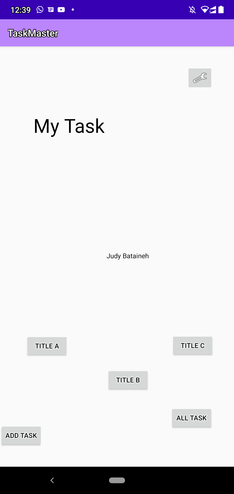
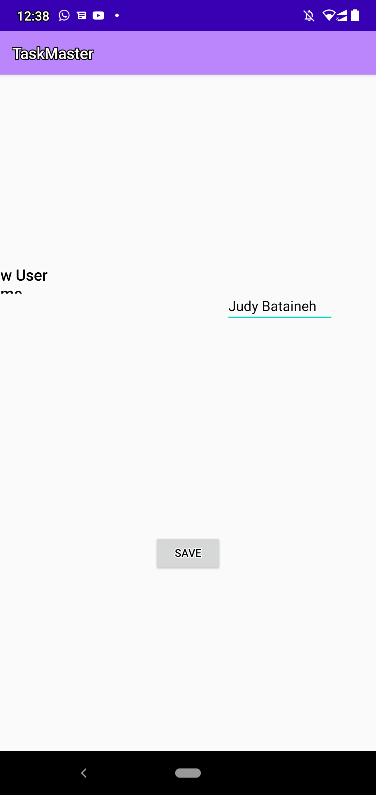
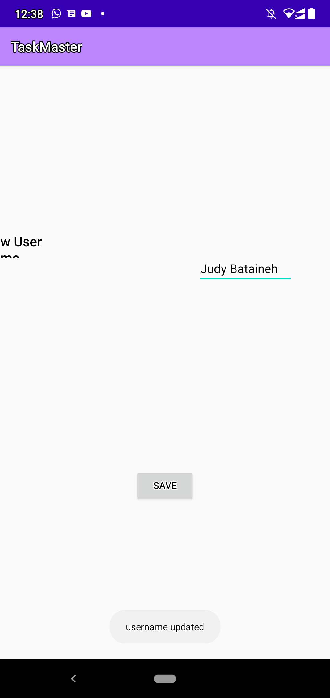

# TaskMaster

## its an android app that allow to you to sechduales and save your tasks, its like a task manager .
## mainly contains of three activites :
* Main Activity : which is hold tow button to navigate you to the other two activities.
  * there is a three new button and the username 
  * every new button goes you to a new activity with the name of the title .
* Add Task Activity : allow you to add a new task with  description 
* All Task Activity : show all your task
* Task Detail : which contains a title of the task and description about it.
* Setting Page: you can add your username.

# give it a look :

