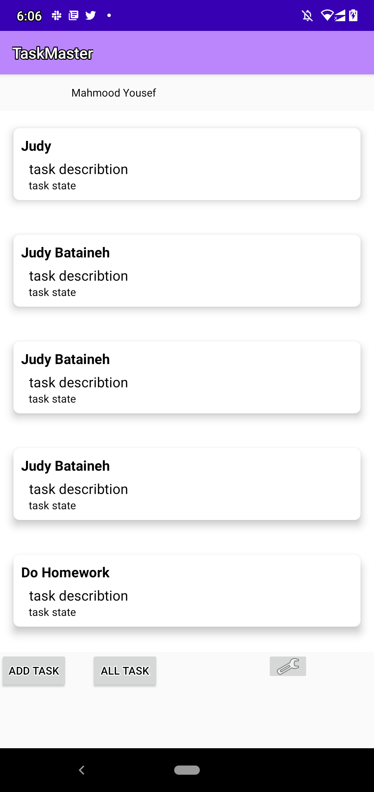
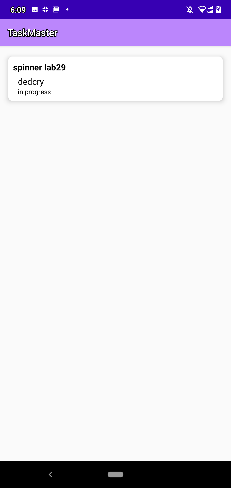
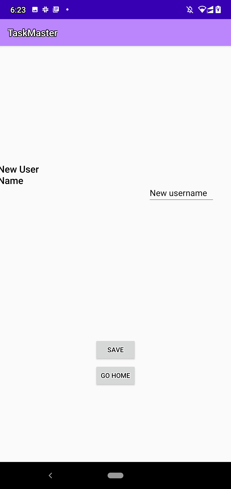
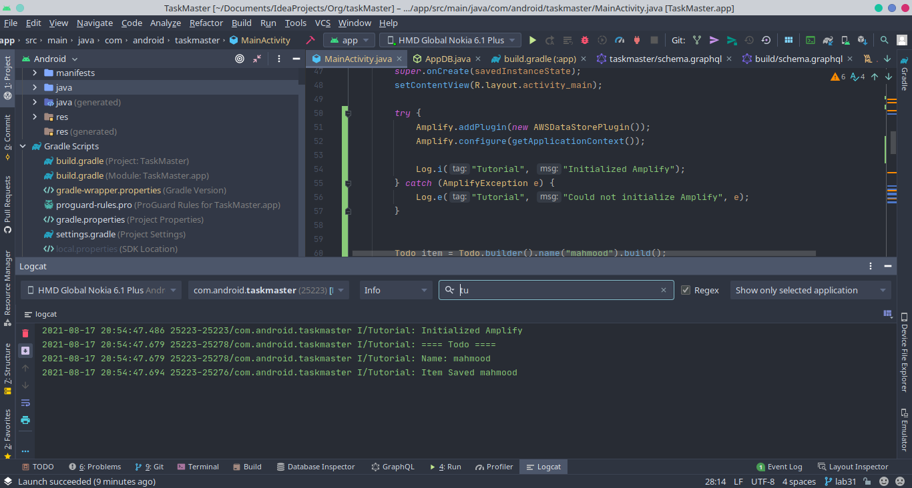
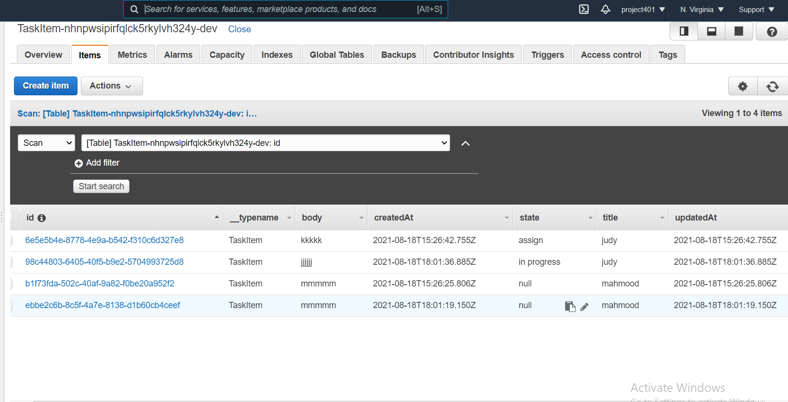
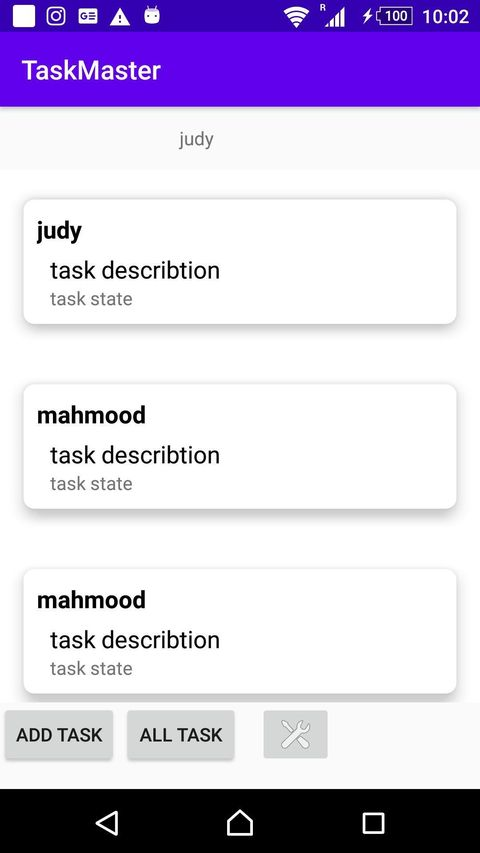

# TaskMaster

## its an android app that allow to you to sechduales and save your tasks, its like a task manager .
## mainly contains of three activites :
* Main Activity : which contains listview of tasks can click on each one of them to view the details of the task.

* Task Detail : which contains a title name and it's body and state of the task.

* Add Task Activity : allow you to add a new task with description
* All Task Activity : show all your task
* Setting Page: you can add your username.
* ## now you can save yor tasks

# awsAmazon
## Amplify
> Amplify initiated Successfully

# give it a look :

